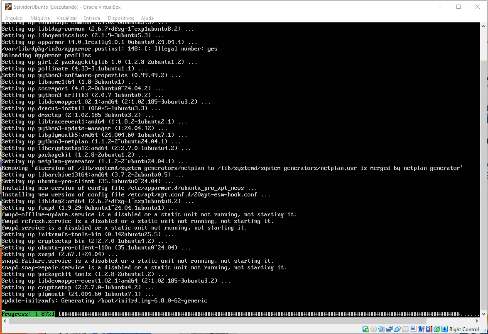

# Preparação de ambiente
Criar uma máquina virtual para instalar as ferramentas e dependências para o estudo de algoritimos e lógica de programação.


## Criar o diretório base
Vamos criar um diretório para guardar a nossa máquinavirtual. Será criado no Drive D. Nomeada com o nome do usuário.


## Preparação da máquina virtual
### Vamos usar a ferramenta de virtualização chamada virtual Box


<a href= "https://www.virtualbox.org/wiki/Downloads"> Faça o downlond aqui </a>


## Criando a máquina virtual


## Criando usuário e senha (Será solicitado após a instalação do Ubuntu)


## Inserindo as configurações dde Hardware para a instalação do Ubuntu


Concluindo a configuração de hardware, clique em finalizar.

# Instalando e configurando a Linux Ubuntu Server

Após a instalação do Ubuntu, insira o usuário e a senha que criou na configuração na maquina virtualbox


Observação: Aperte enter para aparecer o usuário e senha.

## Configuração e atualização dos comandos e app do Ubuntu

Na tela informa as configurações de hardware utilizados pelo sistema operacional e a quantidade de updates a serem aplicados


Para atualizar o sistema iremos usar os seguintes comandos:

```` shell
sudo apt update -y
````


```` shell
sudo apt upgrade -y
````



_reboot (irá reiniciar o Ubuntu)

_Instalar o cockpit - ferramenta para gerenciar o servidor, por meio de um ambiente gráfico online


```` shell
sudo apt install cockpit
````


Confirme a instalação com: yes


